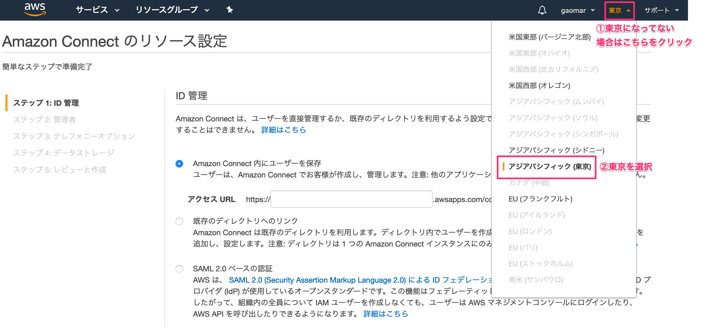
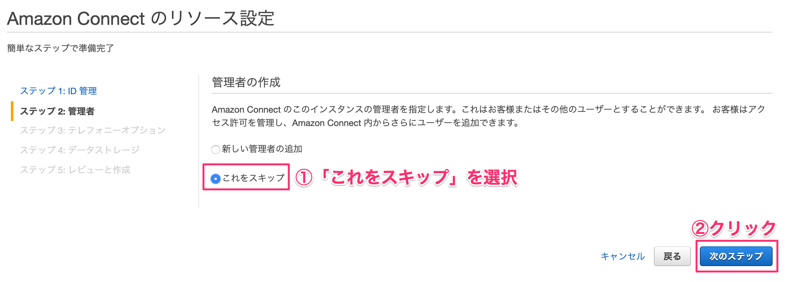
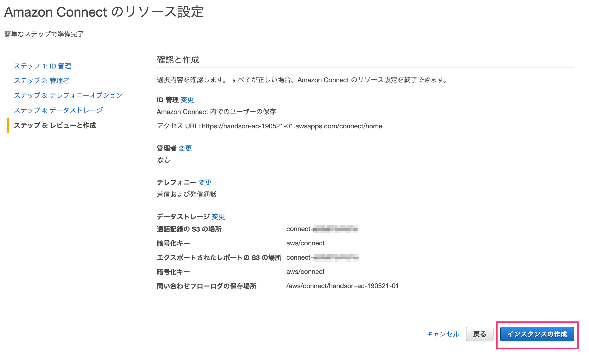
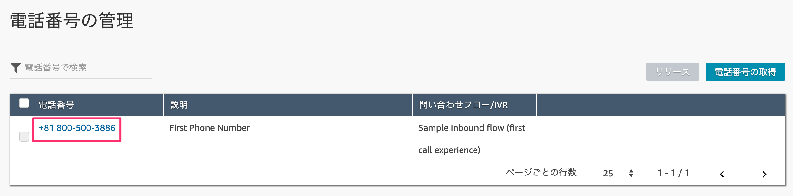

# LINE Bot + Amazon Connectハンズオン

## リソースを作成する
### 1-1. リソースを作成する
AWSにアクセスし、お持ちのAWSアカウントでログインします。  
[https://aws.amazon.com/jp/](https://aws.amazon.com/jp/)

コンソール画面が開いたら、サービス検索から【Amazon Connect】と入力して検索します。
出てきた［Amazon Connect］をクリックします。

［今すぐ始める］ボタンをクリックします。

東京リージョンになっているか確認してください。
なっていない方は右上から「**アジアパシフィック（東京）**」を選択します。

※既にリソースをお持ちの方は［インスタンスを追加する］ボタンを押して今回作成する専用のインスタンスを作成してください。

アクセスURLに今回使用するための名前を決めます。

［handson-ac-{今日の日付}-{連番}］という感じで他の人と被らないような名前にします。

ステップ２の管理者の作成は後でできるので、「これをスキップ」を選択してから、［次のステップ］ボタンをクリックします。

ステップ３のテレフォニーオプションもそのまま何もせず［次のステップ］ボタンをクリックします。

ステップ４のデータストレージもそのまま［次のステップ］ボタンをクリックします。

ステップ５で最終確認をして問題なければ［インスタンスの作成］ボタンをクリックします。

1〜2分ほど作成に時間がかかります。

成功すれば、［今すぐ始める］ボタンをクリックします。

## 電話番号を取得しよう
### 2-1.電話番号を取得する
Amazon Connect専用の電話番号を手に入れます。
別のタブでAmazon Connect用の画面が表示されるので、そこに表示されている［今すぐ始める］ボタンをクリックします。

日本語になっていない場合は右上から「日本語」を選択してください。

電話番号の取得で、国は`Japan +81`を選択します。

次のタイプは2種類あります。お好きな方を選んでください。

| タイプ       |       特徴 |
|:-----------------|:------------------|
| Direct Dial             | 050番号が取得できる。発信者が通話料負担する。 |
| Toll Free             | 0800番号が取得できる。発信者の通話料無料（フリーダイヤル）開発者が負担する。 |

最後にお好きな番号を選択して、［次へ］ボタンをクリックします。

［Continue］ボタンをクリックします。

### 2-2.取得した電話番号を確認する
取得した電話番号を確認します。
左メニューからルーティングの電話番号をクリックします。

取得した電話番号が表示されています。別の番号を増やしたい場合は右側にある［電話番号の追加］ボタン押して追加することもできます。

